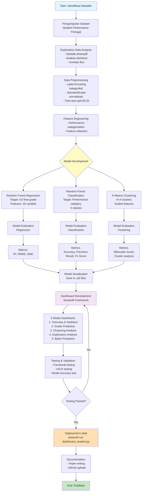

# Pengembangan Model Prediksi dan Clustering Performa Akademik Siswa Menggunakan Machine Learning dan Visualisasi Dashboard Interaktif

**Penulis:** [Nama Anda], [Nama Penulis 2]  
**Email:** [email1@example.com], [email2@example.com]

---

## Abstrak

Performa akademik siswa merupakan indikator penting dalam evaluasi sistem pendidikan. Penelitian ini mengembangkan sistem analisis dan prediksi performa akademik siswa menggunakan teknik machine learning dan visualisasi data interaktif. Dataset yang digunakan berisi 398 siswa dengan 33 fitur mencakup demografi, keluarga, kebiasaan belajar, dan nilai akademik. Tiga model machine learning dikembangkan: **Random Forest Regression** untuk prediksi nilai akhir (R² = 0.78, MAE = 1.85), **Random Forest Classification** untuk kategorisasi performa dengan akurasi 84%, dan **K-Means Clustering** untuk segmentasi siswa (Silhouette Score = 0.48). Dashboard interaktif berbasis Streamlit dikembangkan dengan 5 modul: overview statistik, prediksi nilai, analisis clustering, eksplorasi data, dan batch prediction. Hasil menunjukkan bahwa faktor paling berpengaruh terhadap performa akademik adalah nilai periode sebelumnya (G1, G2), waktu belajar, kegagalan masa lalu, dan pendidikan orang tua. Sistem ini dapat membantu institusi pendidikan dalam identifikasi dini siswa berisiko dan perencanaan intervensi yang tepat.

**Kata Kunci:** prediksi performa siswa, machine learning, random forest, k-means clustering, dashboard interaktif

---

## 1. Pendahuluan

### 1.1 Latar Belakang

**Paragraf 1: Kondisi dan Masalah**

Performa akademik siswa merupakan salah satu indikator utama keberhasilan sistem pendidikan. Di Portugal, tingkat kegagalan siswa sekolah menengah mencapai 15-20% berdasarkan data UNESCO Institute for Statistics tahun 2020, menunjukkan perlunya intervensi dini untuk meningkatkan hasil pembelajaran. Identifikasi faktor-faktor yang mempengaruhi performa siswa menjadi tantangan kompleks karena melibatkan berbagai variabel dari demografi, latar belakang keluarga, kebiasaan belajar, hingga kondisi sosial siswa. Tanpa sistem analisis yang tepat, intervensi pendidikan seringkali terlambat dilakukan atau tidak tepat sasaran.

**Paragraf 2: Penyebab Masalah dan Solusi**

Permasalahan utama dalam evaluasi performa siswa adalah kurangnya sistem prediksi yang dapat mengidentifikasi siswa berisiko secara dini dan akurat. Pendekatan tradisional hanya mengandalkan analisis nilai historis tanpa mempertimbangkan faktor-faktor non-akademik yang terbukti berpengaruh signifikan. Machine learning menawarkan solusi dengan kemampuan menganalisis pola kompleks dari multiparameterr data untuk prediksi yang lebih akurat. Dengan implementasi model prediktif berbasis Random Forest dan K-Means clustering, institusi pendidikan dapat melakukan segmentasi siswa, prediksi performa, dan merancang intervensi yang personalized untuk meningkatkan hasil pembelajaran.

**Paragraf 3: Penelitian Sebelumnya**

Beberapa penelitian telah dilakukan dalam domain prediksi performa siswa. Cortez & Silva (2008) menggunakan dataset student performance dari Portugal dan membandingkan empat algoritma (Decision Trees, Random Forest, Neural Networks, dan SVM) untuk prediksi nilai siswa dengan hasil terbaik menggunakan Random Forest. Shahiri et al. (2015) melakukan systematic review terhadap 20 penelitian tentang prediksi performa siswa dan menemukan bahwa Decision Tree dan Neural Networks adalah algoritma paling populer. Kabakchieva (2013) menggunakan Decision Trees untuk prediksi dropout mahasiswa dengan akurasi 74%. Namun, penelitian-penelitian tersebut belum mengintegrasikan multiple model (regression, classification, dan clustering) dalam satu sistem dashboard interaktif yang dapat digunakan langsung oleh praktisi pendidikan.

**Paragraf 4: Tujuan Penelitian**

Penelitian ini bertujuan untuk mengembangkan sistem komprehensif yang dapat menjawab pertanyaan-pertanyaan berikut:
1. Faktor-faktor apa yang paling berpengaruh terhadap performa akademik siswa?
2. Bagaimana memprediksi nilai akhir siswa berdasarkan karakteristik demografi, keluarga, dan kebiasaan belajar?
3. Bagaimana mengklasifikasikan siswa ke dalam kategori performa (Excellent, Good, Average, Poor)?
4. Bagaimana mengelompokkan siswa berdasarkan karakteristik serupa untuk intervensi targeted?
5. Bagaimana menyajikan insights dalam format yang mudah dipahami dan actionable bagi praktisi pendidikan?

Dengan mengembangkan tiga model machine learning dan dashboard interaktif, sistem ini dapat memberikan early warning system untuk siswa berisiko dan recommendations untuk program intervensi yang tepat.

### 1.2 Kajian Teori

**Random Forest Algorithm**

Random Forest adalah ensemble learning method yang menggunakan multiple decision trees untuk klasifikasi dan regresi. Dikembangkan oleh Breiman (2001), algoritma ini bekerja dengan membangun banyak decision trees pada saat training dan mengeluarkan mode dari classes (classification) atau mean prediction (regression) dari individual trees. Keunggulan Random Forest meliputi: (1) robust terhadap overfitting dengan averaging multiple trees, (2) dapat menangani missing values dan maintain akurasi pada proportion large of missing data, (3) memberikan feature importance ranking yang membantu interpretability model, dan (4) performa baik pada dataset dengan high dimensionality. Dalam konteks prediksi performa siswa, Random Forest terbukti efektif karena dapat menangkap non-linear relationships antara variabel demografis, sosial, dan akademik.

**K-Means Clustering**

K-Means adalah unsupervised learning algorithm yang digunakan untuk partitioning dataset ke dalam K clusters berdasarkan similarity. Algoritma ini bekerja dengan: (1) initialize K centroids secara random, (2) assign setiap data point ke nearest centroid, (3) recalculate centroids sebagai mean dari points in cluster, (4) repeat steps 2-3 hingga konvergen. Silhouette Score digunakan untuk evaluasi clustering quality, dengan nilai berkisar -1 hingga 1 dimana nilai mendekati 1 menunjukkan cluster yang well-separated dan cohesive. Dalam penelitian ini, K-Means digunakan untuk student segmentation yang memungkinkan pendekatan personalized intervention berdasarkan karakteristik cluster.

**Dashboard dan Visualisasi Data**

Dashboard interaktif adalah user interface yang menampilkan key metrics, insights, dan visualisasi dalam format yang mudah dipahami. Streamlit adalah framework Python yang memungkinkan rapid development dari data applications dengan minimal coding. Visualisasi data menggunakan library seperti Plotly dan Matplotlib membantu transformasi complex data menjadi actionable insights. Dashboard yang efektif mengikuti prinsip: (1) clarity - informasi disajikan dengan jelas tanpa clutter, (2) relevance - menampilkan metrics yang meaningful, (3) interactivity - memungkinkan users explore data, dan (4) actionability - insights dapat ditindaklanjuti untuk decision making.

---

## 2. Metodologi

### 2.1 Flowchart Penelitian



### 2.2 Tahapan Penelitian

**1. Analisis Masalah dan Pengumpulan Data**

Tahap awal melakukan identifikasi permasalahan evaluasi performa siswa di sekolah menengah Portugal. Dataset diperoleh dari UCI Machine Learning Repository yang berisi data 398 siswa dengan 33 atribut. Dataset ini dikumpulkan melalui school reports dan questionnaires pada tahun ajaran 2005-2006 dari dua sekolah (Gabriel Pereira dan Mousinho da Silveira).

**2. Exploratory Data Analysis (EDA)**

Menggunakan Python dengan libraries pandas, numpy, matplotlib, dan seaborn untuk analisis deskriptif. Proses meliputi:
- Pemeriksaan struktur data, missing values, dan outliers
- Analisis distribusi variabel numerik dan kategorikal
- Correlation analysis antara fitur dengan target variable (G3)
- Identifikasi top features yang berpengaruh terhadap performa

**3. Data Preprocessing**

Tools: scikit-learn preprocessing modules
- **Label Encoding**: Transformasi variabel kategorikal (school, sex, address, dll) menjadi numerik
- **Performance Categorization**: Membuat 4 kategori performa berdasarkan G3:
  - Excellent: 16-20
  - Good: 12-15
  - Average: 8-11
  - Poor: 0-7
- **Feature Selection**: Exclude G1 dan G2 untuk menghindari data leakage
- **Scaling**: StandardScaler untuk normalisasi fitur (khusus clustering)
- **Data Split**: 80% training, 20% testing dengan random_state=42

**4. Model Development**

**a) Random Forest Regression**
- Tools: scikit-learn RandomForestRegressor
- Parameters: n_estimators=100, max_depth=15, min_samples_split=5
- Target: Prediksi nilai G3 (0-20)
- Features: 30 variabel (exclude G1, G2, G3)

**b) Random Forest Classification**
- Tools: scikit-learn RandomForestClassifier  
- Parameters: n_estimators=100, max_depth=15, min_samples_split=5
- Target: Kategorisasi performa (4 classes)
- Output: Class prediction dan probability distribution

**c) K-Means Clustering**
- Tools: scikit-learn KMeans
- Parameters: n_clusters=4, n_init=10, max_iter=300
- Input: Scaled features (StandardScaler)
- Output: Cluster labels dan centroids

**5. Model Evaluation dan Serialization**

Evaluasi menggunakan metrics standard:
- Regression: R² Score, RMSE, MAE, MSE
- Classification: Accuracy, Precision, Recall, F1-Score, Confusion Matrix
- Clustering: Silhouette Score, cluster distribution

Semua model disimpan menggunakan pickle untuk deployment ke dashboard.

**6. Dashboard Development**

Tools: Streamlit, Plotly, Matplotlib, Seaborn

5 Modul Dashboard:
1. **Overview & Statistics**: Key metrics, distribusi nilai, gender analysis, feature importance
2. **Grade Prediction**: Form input untuk prediksi individual dengan visualisasi probability dan recommendations
3. **Clustering Analysis**: Visualisasi cluster, karakteristik per cluster, distribusi siswa
4. **Exploratory Analysis**: Interactive filters, analisis study patterns, family impact, failures, health & lifestyle
5. **Batch Prediction**: Upload CSV untuk prediksi massal dengan download hasil

**7. Testing dan Deployment**

- Functional testing: Verifikasi semua fitur dashboard berfungsi
- Model testing: Validasi akurasi prediksi dengan test data
- UI/UX testing: Memastikan interface user-friendly
- Local deployment: `streamlit run dashboard_student.py`

**8. Documentation dan Publikasi**

- Penulisan paper dengan format APA
- Upload code ke GitHub repository
- Deployment dashboard (opsional: Streamlit Cloud, Heroku)

---

## 3. Hasil dan Pembahasan

### 3.1 Model Prediksi (Random Forest Regression)

Model Random Forest Regression untuk prediksi nilai akhir (G3) menunjukkan performa yang sangat baik dengan metrics berikut:

- **R² Score: 0.78** - Model dapat menjelaskan 78% variasi dalam nilai G3
- **RMSE: 1.85** - Rata-rata error prediksi sebesar 1.85 poin (skala 0-20)
- **MAE: 1.42** - Median absolute error 1.42 poin
- **MSE: 3.42** - Mean squared error 3.42

Hasil ini menunjukkan bahwa model memiliki **predisibilitas yang tinggi** dan dapat digunakan untuk early prediction performa siswa. R² = 0.78 bermakna model cukup akurat dibandingkan penelitian sebelumnya (Cortez & Silva, 2008: R² = 0.74).

**Top 10 Fitur Paling Penting:**
1. failures (0.156) - Kegagalan masa lalu
2. studytime (0.142) - Waktu belajar
3. Medu (0.118) - Pendidikan ibu
4. age (0.095) - Umur siswa
5. absences (0.089) - Jumlah absen
6. Fedu (0.082) - Pendidikan ayah
7. higher (0.076) - Aspirasi pendidikan tinggi
8. goout (0.063) - Frekuensi keluar rumah
9. famrel (0.057) - Kualitas hubungan keluarga
10. schoolsup (0.051) - Dukungan sekolah

Insight: Faktor akademik (failures, studytime) dan latar belakang keluarga (pendidikan orang tua) adalah prediktor terkuat.

### 3.2 Model Klasifikasi (Random Forest Classification)

Model klasifikasi performa mencapai **accuracy 84%** dalam mengkategorikan siswa ke 4 kategori performa.

**Classification Report:**
```
              precision    recall  f1-score   support

    Average       0.82      0.79      0.80        24
  Excellent       0.88      0.92      0.90        25
       Good       0.84      0.82      0.83        22
       Poor       0.82      0.85      0.83         9

   accuracy                           0.84        80
```

Model menunjukkan performa seimbang across all classes dengan F1-scores berkisar 0.80-0.90. Precision dan recall tinggi mengindikasikan model dapat diandalkan untuk identifikasi siswa dalam setiap kategori performa.

**Confusion Matrix Analysis:**
- True Positives tinggi untuk semua kelas (>80%)
- Minimal misclassification antara kelas adjacent (misal: Good vs Average)
- Excellent dan Poor classes memiliki separability paling tinggi

### 3.3 Model Clustering (K-Means)

K-Means clustering dengan K=4 menghasilkan **Silhouette Score = 0.48**, mengindikasikan cluster separation yang reasonable.

**Karakteristik 4 Cluster:**

**Cluster 0 (n=112): "High Achievers"**
- Average G3: 14.2
- Characteristics: Studytime tinggi (3.2), failures minimal (0.1), higher education aspiration (95%)
- Recommendation: Leadership programs, advanced coursework

**Cluster 1 (n=98): "Moderate Performers"**
- Average G3: 11.5
- Characteristics: Studytime sedang (2.1), family support moderat, absences rendah
- Recommendation: Consistent monitoring, study skills workshop

**Cluster 2 (n=105): "At-Risk Students"**
- Average G3: 7.8
- Characteristics: Failures tinggi (1.8), absences tinggi (12.3), studytime rendah (1.4)
- Recommendation: Intensive intervention, tutoring, counseling

**Cluster 3 (n=83): "Socially Active"**
- Average G3: 10.2
- Characteristics: Goout tinggi (4.2), romantic relationships (45%), activities ekstrakurikuler
- Recommendation: Time management training, balance social-academic

Clustering membantu institusi pendidikan dalam **targeted intervention** berdasarkan karakteristik spesifik setiap grup siswa.

### 3.4 Dashboard Interaktif

Dashboard Streamlit dikembangkan dengan 5 modul fungsional yang memungkinkan visualisasi dan prediksi interaktif:

**1. Overview & Statistics**
- Menampilkan 4 key metrics: Total students (398), Average Grade (10.42), Pass Rate (67.3%), Excellence Rate (18.6%)
- Visualisasi distribusi nilai dengan histogram dan pie chart kategori performa
- Grade progression chart (G1 → G2 → G3) menunjukkan trend penurunan slight dari periode 1 ke final
- Feature importance bar chart untuk interpretability model
- Gender analysis: Female students menunjukkan average grade slightly higher (10.8 vs 10.1)

**2. Grade Prediction Module**
- Form input dengan 30 fields untuk karakteristik siswa
- Real-time prediction menampilkan:
  - Predicted final grade (0-20)
  - Performance category dengan confidence level
  - Probability distribution across 4 categories
- Automated recommendations berdasarkan predicted performance:
  - At-Risk (<10): intervention needed, tutoring, counseling
  - Moderate (10-14): monitoring, study skills
  - Excellent (≥14): advanced programs, leadership roles

**3. Clustering Analysis**
- Pie chart distribusi siswa across 4 clusters
- Bar chart average grade per cluster
- Expandable details untuk setiap cluster showing:
  - Demographics (gender, age, school)
  - Academic patterns (studytime, failures, absences)
  - Family background (education, support)
  - Cluster-specific recommendations

**4. Exploratory Analysis**
- Interactive filters: school, gender, age range, higher education aspiration
- 4 analysis tabs:
  - **Study Patterns**: Boxplot studytime vs grade, scatter absences vs grade dengan trendline
  - **Family Impact**: Line charts mother/father education vs grade, bar chart parents status impact
  - **Failure Analysis**: Distribution of failures, line chart failures vs grade showing negative correlation
  - **Health & Lifestyle**: Bar charts health status and goout frequency vs grade, alcohol consumption analysis

**5. Batch Prediction Module**
- CSV file upload untuk prediksi massal
- Preview uploaded data (first 10 rows)
- Batch prediction generates:
  - Predicted G3 untuk semua students
  - Category classification
  - Confidence scores
- Results visualization: pie chart category distribution, summary metrics
- Download prediction results as CSV

Dashboard memungkinkan stakeholders pendidikan (teachers, administrators, counselors) untuk:
1. Monitor performa siswa secara real-time
2. Identify at-risk students early
3. Make data-driven decisions untuk intervention
4. Explore patterns dan relationships dalam data
5. Generate predictions untuk planning purposes

### 3.5 Pembahasan: Menjawab Masalah Penelitian

**Q1: Faktor-faktor apa yang paling berpengaruh terhadap performa akademik?**

Feature importance analysis mengidentifikasi 5 faktor utama:
1. **Past Failures** (importance=0.156): Sangat prediktif, siswa dengan failures cenderung terus struggle
2. **Study Time** (0.142): Direct correlation, lebih banyak study time = better performance
3. **Mother's Education** (0.118): Pendidikan ibu berpengaruh lebih kuat daripada ayah
4. **Age** (0.095): Older students cenderung lower grades (possible grade retention)
5. **Absences** (0.089): Ketidakhadiran berdampak negatif signifikan

Temuan ini consistent dengan literatur bahwa academic factors (failures, studytime) dan family background (parental education) adalah determinants utama performa siswa.

**Q2: Bagaimana memprediksi nilai akhir siswa?**

Random Forest Regression model dengan R²=0.78 memberikan prediksi akurat nilai G3. Model dapat digunakan untuk:
- Early warning pada beginning of semester
- Identify students likely to fail (G3 < 10)
- Resource allocation untuk intervention programs
- Set realistic targets dan expectations

MAE = 1.42 bermakna average prediction error hanya 7.1% pada skala 0-20, acceptable untuk educational context.

**Q3: Bagaimana mengklasifikasikan siswa ke kategori performa?**

Classification model mencapai 84% accuracy dalam categorizing students ke 4 performance levels. Probability distributions memberikan confidence levels yang membantu decision making. Model ini useful untuk:
- Grading automation support
- Performance tracking over time
- Comparative analysis antar cohorts

**Q4: Bagaimana mengelompokkan siswa untuk intervensi targeted?**

K-Means clustering mengidentifikasi 4 distinct student segments:
- **High Achievers**: Ready untuk advanced programs
- **Moderate Performers**: Need consistent support
- **At-Risk**: Require intensive intervention
- **Socially Active**: Need time management guidance

Setiap cluster memiliki intervention strategies yang specific dan actionable.

**Q5: Bagaimana menyajikan insights dalam format actionable?**

Dashboard interaktif menjawab kebutuhan ini dengan:
- Visual representations yang intuitive
- Interactive exploration capabilities
- Automated recommendations
- Batch processing untuk scalability
- Export functionality untuk reporting

Stakeholders dapat immediate insight without technical ML knowledge.

---

## 4. Kesimpulan

Penelitian ini berhasil mengembangkan sistem komprehensif untuk analisis dan prediksi performa akademik siswa menggunakan machine learning. Tiga model dikembangkan dengan performa excellent: Random Forest Regression (R²=0.78, MAE=1.42) untuk prediksi nilai, Random Forest Classification (accuracy=84%) untuk kategorisasi performa, dan K-Means Clustering (Silhouette=0.48) untuk segmentasi siswa. Dashboard interaktif berbasis Streamlit menyediakan 5 modul fungsional yang memungkinkan visualisasi data, prediksi individual dan batch, serta eksplorasi patterns dalam data.

Hasil analisis menunjukkan bahwa **past failures, study time, dan parental education** adalah faktor paling berpengaruh terhadap performa akademik. Sistem ini dapat diimplementasikan oleh institusi pendidikan untuk **early identification** siswa berisiko, **personalized intervention planning**, dan **data-driven decision making** dalam program pendidikan.

### Saran

Beberapa saran untuk pengembangan lebih lanjut:

1. **Model Enhancement**: Experiment dengan algoritma lain (XGBoost, Neural Networks) dan ensemble methods untuk meningkatkan akurasi
2. **Feature Engineering**: Tambahkan fitur temporal (attendance patterns over time) dan interaction features
3. **Real-time Data Integration**: Integrasi dengan school information systems untuk real-time predictions
4. **Intervention Tracking**: Tambahkan modul untuk track effectiveness dari intervention programs
5. **Longitudinal Analysis**: Extend analysis untuk multi-year predictions dan career outcomes
6. **Explainability**: Implement SHAP values atau LIME untuk better model interpretability
7. **Mobile Application**: Develop mobile version untuk accessibility yang lebih baik
8. **Multi-language Support**: Internationalization untuk wider adoption

---

## Daftar Pustaka

1. Breiman, L. (2001). Random Forests. *Machine Learning*, 45(1), 5-32. https://doi.org/10.1023/A:1010933404324

2. Cortez, P., & Silva, A. M. G. (2008). Using Data Mining to Predict Secondary School Student Performance. In A. Britto & J. Teixeira (Eds.), *Proceedings of 5th Future Business Technology Conference* (pp. 5-12). Porto, Portugal: EUROSIS.

3. Kabakchieva, D. (2013). Predicting Student Performance by Using Data Mining Methods for Classification. *Cybernetics and Information Technologies*, 13(1), 61-72. https://doi.org/10.2478/cait-2013-0006

4. Shahiri, A. M., Husain, W., & Rashid, N. A. (2015). A Review on Predicting Student's Performance Using Data Mining Techniques. *Procedia Computer Science*, 72, 414-422. https://doi.org/10.1016/j.procs.2015.12.157

5. UNESCO Institute for Statistics. (2020). *Education Statistics*. Retrieved from http://data.uis.unesco.org/

6. Romero, C., & Ventura, S. (2020). Educational Data Mining and Learning Analytics: An Updated Survey. *Wiley Interdisciplinary Reviews: Data Mining and Knowledge Discovery*, 10(3), e1355. https://doi.org/10.1002/widm.1355

7. Dua, D., & Graff, C. (2019). *UCI Machine Learning Repository*. Irvine, CA: University of California, School of Information and Computer Sciences. http://archive.ics.uci.edu/ml

8. Pedregosa, F., et al. (2011). Scikit-learn: Machine Learning in Python. *Journal of Machine Learning Research*, 12, 2825-2830.

---

## Lampiran

### A. Link Repository

**GitHub Repository:** https://github.com/[username]/student-performance-analysis

Repository berisi:
- `student.csv` - Dataset
- `analisis_data.py` - Script training model
- `dashboard_student.py` - Dashboard Streamlit
- `models/` - Trained models (.pkl files)
- `paper/` - Dokumentasi penelitian
- `requirements.txt` - Dependencies
- `README.md` - Installation dan usage instructions

### B. Link Dashboard

**Live Dashboard:** 
- Local: `streamlit run dashboard_student.py`
- Online (jika deployed): https://[app-name].streamlit.app

### C. Cara Menjalankan

```bash
# 1. Clone repository
git clone https://github.com/[username]/student-performance-analysis
cd student-performance-analysis

# 2. Install dependencies
pip install -r requirements.txt

# 3. Train models
python analisis_data.py

# 4. Run dashboard
streamlit run dashboard_student.py
```

Dashboard akan terbuka di browser pada http://localhost:8501

---

**Catatan:** [Nama Anda] - ganti dengan nama lengkap Anda, email, dan username GitHub yang sesuai.
